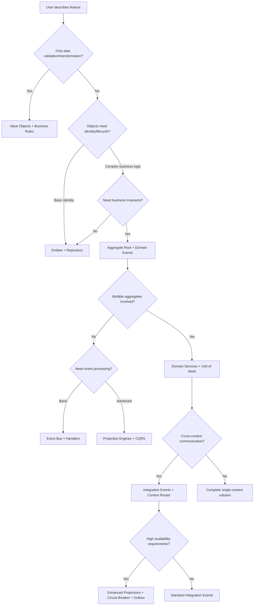

# Faza 1: Analiza Struktury Biblioteki DomainTS

## Component Inventory

### **🏗️ Core Domain Layer**

| Component | Type | Role | Core Dependencies | Capabilities |
|-----------|------|------|-------------------|--------------|
| `ValueObject<T>` | Abstract Base | Immutable domain values | None | Validation, equality by value |
| `Entity<TId>` | Abstract Base | Objects with identity | `EntityId` | Identity management, change tracking |
| `AggregateRoot<TId>` | Abstract Base | Event-sourced consistency boundary | `Entity`, `IDomainEvent` | Event sourcing, apply pattern |
| `EntityId<T>` | Concrete Class | Strong-typed identifiers | `ValueObject` | UUID generation, serialization |

### **📡 Events Architecture**

| Component | Type | Role | Core Dependencies | Advanced Features |
|-----------|------|------|-------------------|-------------------|
| `DomainEvent<T>` | Abstract Class | Domain occurrence records | `IDomainEvent` | Metadata, correlation IDs |
| `IntegrationEvent<T>` | Abstract Class | Cross-context communication | `IIntegrationEvent` | Context routing, transformation |
| `InMemoryEventBus` | Class | Event pub/sub with middleware | `IEventBus` | Middleware pipeline, error handling |
| `UniversalEventDispatcher` | Class | Multi-bus orchestration | Multiple event buses | Bus routing, processor pipeline |
| `EventBusMiddleware` | Interface | Pipeline processing | - | Logging, correlation, error handling |

### **🎯 CQRS & Projections**

| Component | Type | Role | Core Dependencies | Resilience Features |
|-----------|------|------|-------------------|---------------------|
| `BaseProjection<T>` | Abstract Class | Read model builder | `IProjection` | State management, event handling |
| `ProjectionEngine` | Class | Projection processor | `BaseProjection` | Basic processing |
| `EnhancedProjectionBuilder` | Class | Production-ready projections | `ProjectionEngine` | Circuit breaker, retry, snapshots |
| `ProjectionCapability` | Abstract Class | Projection extensions | - | Checkpoints, metrics, dead letter |
| `ProjectionEngineRegistry` | Class | Multi-projection management | Multiple engines | Coordination, lifecycle |

### **🗄️ Infrastructure Patterns**

| Component | Type | Role | Core Dependencies | Integration Points |
|-----------|------|------|-------------------|-------------------|
| `IRepository<T>` | Interface | Standard aggregate persistence | None | Basic CRUD operations |
| `IBaseRepository` | Abstract Class | Event-aware repository | `IEventDispatcher` | Auto event handling |
| `IUnitOfWork` | Interface | Transaction coordination | Multiple repositories | Event collection, atomicity |
| `OutboxService` | Class | Reliable messaging | `IOutboxRepository` | Message scheduling, retry logic |
| `IMessagePublisher` | Interface | External message delivery | - | Integration with message brokers |

### **🎯 Domain Logic Patterns**

| Component | Type | Role | Core Dependencies | Composition Features |
|-----------|------|------|-------------------|---------------------|
| `CompositeSpecification<T>` | Abstract Class | Composable business rules | `ISpecification` | AND, OR, NOT operations |
| `BusinessRuleValidator<T>` | Class | Complex validation logic | `IValidator`, `Result` | Conditional rules, nested validation |
| `IBusinessPolicy<T>` | Interface | Strategic business decisions | - | Configurable rules, policy violation |
| `SpecificationValidator<T>` | Class | Specification-based validation | `ISpecification` | Rule composition |

### **🛠️ Domain Services (Hierarchical)**

| Component | Type | Role | Core Dependencies | DI Features |
|-----------|------|------|-------------------|-------------|
| `IBaseDomainService` | Base Interface | Service identification | None | Service ID |
| `EventAwareDomainService` | Abstract Class | Event publishing services | `IEventBus` | Auto event bus injection |
| `UnitOfWorkAwareDomainService` | Abstract Class | Transactional services | `IUnitOfWork` | Transaction management |
| `AsyncDomainService` | Abstract Class | Lifecycle-managed services | - | Initialize/dispose patterns |
| `DomainServiceContainer` | Class | DI container with dependency resolution | - | Circular dependency detection |

### **🔗 Integration & Communication**

| Component | Type | Role | Core Dependencies | Routing Features |
|-----------|------|------|-------------------|------------------|
| `ContextRouter` | Class | Event routing between contexts | - | Pattern matching, specification-based routing |
| `DomainToIntegrationTransformer` | Abstract Class | Event transformation | `ContextRouter` | Payload mapping, event type transformation |
| `IntegrationEventBus` | Class | Context-aware event bus | `IEventBus` | Context filtering, targeted delivery |
| `AntiCorruptionLayer` | Pattern | External system isolation | Transformers, Adapters | Model translation, interface adaptation |

### **🔧 Utilities & Error Handling**

| Component | Type | Role | Core Dependencies | Functional Features |
|-----------|------|------|-------------------|---------------------|
| `Result<TValue, TError>` | Class | Functional error handling | None | Map, flatMap, chain operations |
| `IDomainError` | Abstract Class | Domain-specific errors | None | Error categorization, context data |
| `ValidationError` | Class | Validation failures | `IDomainError` | Property-level error details |
| `ServiceError` | Class | Service-level errors | `IDomainError` | Service operation failures |

## Pattern Implementation Matrix

### **✅ Tactical DDD Patterns**
```
CORE BUILDING BLOCKS:
✅ Value Objects (immutable, validated)
✅ Entities (identity, lifecycle)  
✅ Aggregates (consistency boundary, event sourcing)
✅ Domain Events (with rich metadata)
✅ Domain Services (hierarchical, DI-enabled)
✅ Repositories (standard + event-aware)
✅ Specifications (composable, chainable)

VALIDATION PATTERNS:
✅ Business Rule Validator (conditional, nested)
✅ Specification Validator (composition-based)
✅ Business Policies (strategic rules)
```

### **✅ Strategic DDD Patterns**
```
CONTEXT BOUNDARIES:
✅ Bounded Context communication (Integration Events)
✅ Context Router (intelligent event routing)
✅ Anti-Corruption Layer (model translation)
✅ Event Transformers (cross-context adaptation)

INTEGRATION PATTERNS:
✅ Domain to Integration Event transformation
✅ Context-aware event filtering
✅ Cross-context communication protocols
```

### **✅ Enterprise Architecture Patterns**
```
EVENT-DRIVEN ARCHITECTURE:
✅ Event Sourcing (aggregate-level)
✅ CQRS (read/write separation via projections)
✅ Event Bus (with middleware pipeline)
✅ Universal Event Dispatcher (multi-bus orchestration)

RESILIENCE PATTERNS:
✅ Circuit Breaker (projection-level)
✅ Retry Strategies (configurable, exponential backoff)
✅ Dead Letter Queue (error isolation)
✅ Outbox Pattern (reliable messaging)

PERFORMANCE PATTERNS:
✅ Snapshots (projection optimization)
✅ Checkpoints (progress tracking)
✅ Batch Processing (projection efficiency)
✅ Result Caching (service-level)
```

## Advanced Component Interactions

### **🔄 Primary Interaction Flows**

#### **1. Command Processing Flow:**
```
Command → Domain Service → Aggregate → Events → Universal Dispatcher → [Projections + Integration Events]
```

#### **2. Event-Driven Flow:**
```
Aggregate.apply() → Domain Event → Event Bus → [Event Handlers + Projection Engines + Integration Transformers]
```

#### **3. Query Flow with Projections:**
```
Query → Projection Engine → Enhanced Projection → Cached Result
```

#### **4. Cross-Context Communication:**
```
Domain Event → Integration Transformer → Context Router → Integration Event Bus → External Context
```

### **🎛️ Advanced Integration Points**

#### **Multi-Bus Architecture:**
```
Universal Dispatcher coordinates:
- Domain Event Bus (internal events)
- Integration Event Bus (cross-context events)  
- Projection Processor (read model updates)
- Integration Processor (external communication)
```

#### **Service Hierarchy with Auto-Configuration:**
```
DI Container → Service Registration → Capability Injection → Lifecycle Management
- Event Bus injection for EventAware services
- Unit of Work injection for Transactional services
- Async initialization for Async services
```

#### **Resilience Pipeline:**
```
Projection: Event → Circuit Breaker → Retry Strategy → Dead Letter → Checkpoint
```

---

# Faza 2: Decision Trees & Navigation dla DomainTS

## 🧭 Quick Decision Matrix

### **Feature Complexity Assessment**

| User Need | Complexity Level | Primary Components | Optional Enhancements |
|-----------|------------------|-------------------|----------------------|
| Simple data validation | **Basic** | `ValueObject` + `BusinessRuleValidator` | `Specifications` |
| CRUD with business rules | **Intermediate** | `Entity` + `Repository` + `BusinessRuleValidator` | `Domain Events` |
| Complex business workflow | **Advanced** | `AggregateRoot` + `Domain Events` + `Domain Service` | `Projections` + `Unit of Work` |
| Multi-context system | **Expert** | All Advanced + `Integration Events` + `Context Router` | `Anti-Corruption Layer` |
| High-scale event processing | **Enterprise** | Expert + `Enhanced Projections` + `Circuit Breaker` | `Outbox Pattern` |

## 🎯 Primary Decision Trees

### **Decision Tree 1: "What components do I need?"**



### **Decision Tree 2: "What level of event-driven architecture?"**

```mermaid
flowchart TD
    EventStart[Event-driven needs?] --> NoEvents{No events needed?}
    NoEvents -->|True| SimpleRepo[Standard Repository pattern]
    NoEvents -->|False| BasicEvents{Simple notifications?}
    
    BasicEvents -->|Yes| DomainEvents[Domain Events + Event Bus]
    BasicEvents -->|No| ComplexEvents{Complex event flows?}
    
    ComplexEvents -->|Yes| EventSourcing[Event Sourcing + Aggregate.apply()]
    ComplexEvents -->|No| DomainEvents
    
    DomainEvents --> ReadModels{Need read models?}
    EventSourcing --> ReadModels
    
    ReadModels -->|Yes| BasicProjections[Basic Projections]
    ReadModels -->|No| EventHandlers[Simple Event Handlers]
    
    BasicProjections --> Performance{Performance critical?}
    Performance -->|Yes| EnhancedProjections[Enhanced Projections + Resilience]
    Performance -->|No| BasicProjections
    
    EnhancedProjections --> Distribution{Distributed system?}
    Distribution -->|Yes| UniversalDispatcher[Universal Event Dispatcher + Multi-bus]
    Distribution -->|No| SingleBus[Single Event Bus]
```

## 📊 Component Compatibility Matrix

### **Core Compatibility Grid**

| Component | Works Best With | Can Work With | Avoid Mixing With | Notes |
|-----------|----------------|---------------|-------------------|-------|
| **Value Objects** | Business Rules, Specifications | Any component | Direct mutation patterns | Always immutable |
| **Entities** | Repository, Domain Events | Aggregates, Specifications | Raw data persistence | Need identity management |
| **Aggregate Root** | Domain Events, Repository | Domain Services, Unit of Work | Direct entity access | Central consistency boundary |
| **Domain Events** | Event Bus, Event Handlers | Projections, Integration Events | Synchronous processing | Async by design |
| **Domain Services** | Unit of Work, Event Bus | Multiple Aggregates | Single-aggregate operations | Cross-aggregate coordination |
| **Projections** | Event Bus, Circuit Breaker | Snapshots, Checkpoints | Synchronous queries | Eventually consistent |
| **Integration Events** | Context Router, Transformers | Anti-Corruption Layer | Internal domain logic | Cross-context only |

### **Architecture Level Compatibility**

| Pattern Level | Required Components | Recommended Add-ons | Advanced Options |
|---------------|-------------------|-------------------|------------------|
| **Basic DDD** | Value Objects, Entities, Repository | Business Rules, Specifications | Domain Events |
| **Event-Driven** | + Domain Events, Event Bus | Event Handlers, Projections | Enhanced Projections |
| **CQRS** | + Projections, Separate Read/Write | Snapshots, Checkpoints | Circuit Breaker |
| **Multi-Context** | + Integration Events, Context Router | Transformers, ACL | Universal Dispatcher |
| **Enterprise** | + Enhanced Projections, Outbox | Circuit Breaker, Retry Logic | Multi-bus Architecture |

## 🗺️ Navigation Index

### **Quick Jump Links (by User Intent)**

#### **🚀 Getting Started**
- [Basic Value Objects](#value-objects-guide) `(5min read, Beginner)`
- [Simple Entities](#entities-guide) `(8min read, Beginner)`
- [First Repository](#repository-guide) `(10min read, Beginner)`

#### **🏗️ Core Domain Building**
- [Aggregate Design](#aggregates-guide) `(15min read, Intermediate)`
- [Domain Events](#events-guide) `(12min read, Intermediate)`
- [Business Rules & Validation](#validation-guide) `(18min read, Intermediate)`

#### **📡 Event-Driven Architecture**
- [Event Bus Setup](#event-bus-guide) `(10min read, Intermediate)`
- [Event Sourcing with Aggregates](#event-sourcing-guide) `(20min read, Advanced)`
- [Projection Engines](#projections-guide) `(25min read, Advanced)`

#### **🔗 Integration & Communication**
- [Domain Services](#domain-services-guide) `(15min read, Advanced)`
- [Cross-Context Events](#integration-events-guide) `(30min read, Expert)`
- [Anti-Corruption Layer](#acl-guide) `(20min read, Expert)`

#### **⚡ Enterprise Patterns**
- [Enhanced Projections with Resilience](#enhanced-projections-guide) `(35min read, Expert)`
- [Universal Event Dispatcher](#universal-dispatcher-guide) `(25min read, Expert)`
- [Outbox Pattern](#outbox-guide) `(20min read, Expert)`

### **Quick Decision Helpers**

#### **"I want to build..." → "Use these components"**
```
🛒 E-commerce Order System → Aggregate + Events + Projections + Domain Services
👤 User Management → Entity + Repository + Business Rules + Domain Events  
💰 Payment Processing → Aggregate + Integration Events + Outbox + Circuit Breaker
📊 Analytics Dashboard → Projections + Enhanced Processing + Snapshots
🔄 Multi-service Integration → Integration Events + Context Router + ACL
```

#### **"I'm struggling with..." → "Check these sections"**
```
❌ Validation complexity → [Business Rules Guide] + [Specifications Guide]
❌ Event processing errors → [Enhanced Projections] + [Circuit Breaker]
❌ Cross-service communication → [Integration Events] + [Context Router]
❌ Performance issues → [Snapshots] + [Checkpoints] + [Batch Processing]
❌ Transaction management → [Unit of Work] + [Domain Services]
```

### **Learning Path Navigation**

#### **🎓 Beginner Path (2-4 hours)**
```
1. Value Objects [15min] → 2. Entities [20min] → 3. Repository [25min] 
→ 4. Business Rules [30min] → 5. Simple Domain Service [25min]
```

#### **🎓 Intermediate Path (4-8 hours)**
```
1. Aggregate Design [45min] → 2. Domain Events [30min] → 3. Event Bus [20min]
→ 4. Basic Projections [40min] → 5. Unit of Work [25min]
```

#### **🎓 Advanced Path (8-16 hours)**
```
1. Event Sourcing [60min] → 2. Enhanced Projections [90min] → 3. Domain Services DI [45min]
→ 4. Integration Events [75min] → 5. Multi-bus Architecture [60min]
```

### **Troubleshooting Quick Links**

| Problem Category | Quick Fix Links | Deep Dive Links |
|-----------------|----------------|-----------------|
| **Performance** | [Snapshots](#snapshots), [Caching](#result-caching) | [Enhanced Projections](#enhanced-projections-guide) |
| **Reliability** | [Circuit Breaker](#circuit-breaker), [Retry](#retry-strategy) | [Resilience Patterns](#resilience-guide) |
| **Integration** | [Context Router](#context-router), [Transformers](#transformers) | [Multi-Context Architecture](#integration-guide) |
| **Complexity** | [Decision Trees](#decision-trees), [Feature Templates](#templates) | [Architecture Guidelines](#architecture-guide) |

---

# Faza 3: Feature Recipes & Templates dla DomainTS

## 🍳 Complete Feature Recipes

### **Recipe 1: User Management System**
```typescript
// COMPLEXITY: Intermediate
// COMPONENTS: Entity + Repository + Domain Events + Business Rules
// TIME ESTIMATE: 30-45 minutes

// 1. VALUE OBJECTS
class Email extends ValueObject<string> {
  constructor(value: string) {
    super(value);
    this.validate();
  }
  
  private validate(): void {
    if (!/^[^\s@]+@[^\s@]+\.[^\s@]+$/.test(this.value)) {
      throw new Error('Invalid email format');
    }
  }
}

class UserName extends ValueObject<string> {
  constructor(value: string) {
    super(value);
    if (value.length < 2 || value.length > 50) {
      throw new Error('Username must be 2-50 characters');
    }
  }
}

// 2. ENTITY
class User extends Entity<UserId> {
  constructor(
    id: UserId,
    private email: Email,
    private name: UserName,
    private createdAt: Date = new Date()
  ) {
    super(id);
  }
  
  changeEmail(newEmail: Email): void {
    if (!this.email.equals(newEmail)) {
      this.email = newEmail;
      // Events will be collected automatically in aggregates
    }
  }
  
  // Getters
  getEmail(): Email { return this.email; }
  getName(): UserName { return this.name; }
  getCreatedAt(): Date { return this.createdAt; }
}

// 3. DOMAIN EVENTS
class UserCreated extends DomainEvent<{
  userId: string;
  email: string;
  name: string;
}> {}

class UserEmailChanged extends DomainEvent<{
  userId: string;
  oldEmail: string;
  newEmail: string;
}> {}

// 4. REPOSITORY
interface IUserRepository extends IRepository<User> {
  findByEmail(email: Email): Promise<User | null>;
  findByName(name: UserName): Promise<User[]>;
}

// 5. BUSINESS RULES
const userValidator = BusinessRuleValidator.create<{email: string, name: string}>()
  .addRule('email', 
    (data) => /^[^\s@]+@[^\s@]+\.[^\s@]+$/.test(data.email),
    'Invalid email format'
  )
  .addRule('name',
    (data) => data.name.length >= 2 && data.name.length <= 50,
    'Name must be 2-50 characters'
  );

// USAGE EXAMPLE:
const createUser = async (userData: {email: string, name: string}): Promise<Result<User, ValidationErrors>> => {
  const validation = userValidator.validate(userData);
  if (validation.isFailure) {
    return Result.fail(validation.error);
  }
  
  const user = new User(
    UserId.create(),
    new Email(userData.email),
    new UserName(userData.name)
  );
  
  return Result.ok(user);
};
```

### **Recipe 2: Order Processing System (Event-Driven)**
```typescript
// COMPLEXITY: Advanced
// COMPONENTS: Aggregate + Domain Events + Domain Services + Projections + Unit of Work
// TIME ESTIMATE: 1-2 hours

// 1. VALUE OBJECTS
class Money extends ValueObject<{amount: number, currency: string}> {
  constructor(amount: number, currency: string) {
    super({amount, currency});
    if (amount < 0) throw new Error('Amount cannot be negative');
  }
  
  add(other: Money): Money {
    if (this.value.currency !== other.value.currency) {
      throw new Error('Cannot add different currencies');
    }
    return new Money(this.value.amount + other.value.amount, this.value.currency);
  }
  
  multiply(factor: number): Money {
    return new Money(this.value.amount * factor, this.value.currency);
  }
}

class OrderItem extends ValueObject<{productId: string, quantity: number, unitPrice: Money}> {
  constructor(productId: string, quantity: number, unitPrice: Money) {
    super({productId, quantity, unitPrice});
    if (quantity <= 0) throw new Error('Quantity must be positive');
  }
  
  getTotalPrice(): Money {
    return this.value.unitPrice.multiply(this.value.quantity);
  }
}

// 2. AGGREGATE ROOT
class Order extends AggregateRoot<OrderId> {
  private items: OrderItem[] = [];
  private status: OrderStatus = OrderStatus.DRAFT;
  private customerId: CustomerId;
  private createdAt: Date;
  
  constructor(id: OrderId, customerId: CustomerId) {
    super(id);
    this.customerId = customerId;
    this.createdAt = new Date();
  }
  
  static create(customerId: CustomerId): Order {
    const order = new Order(OrderId.create(), customerId);
    
    order.apply(new OrderCreated({
      orderId: order.getId().value,
      customerId: customerId.value,
      createdAt: new Date()
    }));
    
    return order;
  }
  
  addItem(item: OrderItem): void {
    if (this.status !== OrderStatus.DRAFT) {
      throw new Error('Cannot modify confirmed order');
    }
    
    this.items.push(item);
    
    this.apply(new OrderItemAdded({
      orderId: this.getId().value,
      productId: item.value.productId,
      quantity: item.value.quantity,
      unitPrice: item.value.unitPrice.value
    }));
  }
  
  confirm(): void {
    if (this.items.length === 0) {
      throw new Error('Cannot confirm empty order');
    }
    
    this.status = OrderStatus.CONFIRMED;
    
    this.apply(new OrderConfirmed({
      orderId: this.getId().value,
      customerId: this.customerId.value,
      totalAmount: this.getTotalAmount().value,
      confirmedAt: new Date()
    }));
  }
  
  getTotalAmount(): Money {
    return this.items.reduce(
      (total, item) => total.add(item.getTotalPrice()),
      new Money(0, 'USD')
    );
  }
  
  // Event handlers
  protected onOrderCreated(payload: any): void {
    // State already set in constructor
  }
  
  protected onOrderItemAdded(payload: any): void {
    // Items already added in addItem method
  }
  
  protected onOrderConfirmed(payload: any): void {
    // Status already changed in confirm method
  }
}

// 3. DOMAIN EVENTS
class OrderCreated extends DomainEvent<{
  orderId: string;
  customerId: string;
  createdAt: Date;
}> {}

class OrderItemAdded extends DomainEvent<{
  orderId: string;
  productId: string;
  quantity: number;
  unitPrice: {amount: number, currency: string};
}> {}

class OrderConfirmed extends DomainEvent<{
  orderId: string;
  customerId: string;
  totalAmount: {amount: number, currency: string};
  confirmedAt: Date;
}> {}

// 4. DOMAIN SERVICE
@DomainService({
  serviceId: 'order-processing-service',
  dependencies: ['inventory-service', 'pricing-service'],
  transactional: true,
  publishesEvents: true
})
class OrderProcessingService extends UnitOfWorkAwareDomainService {
  constructor(
    private inventoryService: InventoryService,
    private pricingService: PricingService
  ) {
    super('order-processing-service');
  }
  
  async processOrder(customerId: CustomerId, items: Array<{productId: string, quantity: number}>): Promise<Result<Order, ProcessingError>> {
    return this.executeInTransaction(async () => {
      const orderRepo = this.getRepository<IRepository<Order>>('orders');
      
      // Create order
      const order = Order.create(customerId);
      
      // Validate and add items
      for (const itemData of items) {
        // Check inventory
        const available = await this.inventoryService.checkAvailability(
          itemData.productId, 
          itemData.quantity
        );
        
        if (!available) {
          throw new ProcessingError(`Product ${itemData.productId} not available`);
        }
        
        // Get current price
        const price = await this.pricingService.getPrice(itemData.productId);
        
        // Add item to order
        const orderItem = new OrderItem(
          itemData.productId,
          itemData.quantity,
          price
        );
        
        order.addItem(orderItem);
      }
      
      // Confirm order
      order.confirm();
      
      // Reserve inventory
      for (const itemData of items) {
        await this.inventoryService.reserve(
          itemData.productId,
          itemData.quantity,
          order.getId()
        );
      }
      
      // Save order
      await orderRepo.save(order);
      
      return Result.ok(order);
    });
  }
}

// 5. PROJECTION (for read models)
interface OrderSummaryState {
  totalOrders: number;
  totalRevenue: Money;
  ordersByStatus: Map<OrderStatus, number>;
}

class OrderSummaryProjection extends BaseProjection<OrderSummaryState> {
  readonly name = 'order-summary';
  readonly eventTypes = ['OrderCreated', 'OrderConfirmed'];
  
  createInitialState(): OrderSummaryState {
    return {
      totalOrders: 0,
      totalRevenue: new Money(0, 'USD'),
      ordersByStatus: new Map()
    };
  }
  
  apply(state: OrderSummaryState, event: IExtendedDomainEvent): OrderSummaryState {
    return this.when(state, event, 'OrderCreated', (state, event) => ({
      ...state,
      totalOrders: state.totalOrders + 1
    }))
    .when(state, event, 'OrderConfirmed', (state, event) => ({
      ...state,
      totalRevenue: state.totalRevenue.add(new Money(
        event.payload.totalAmount.amount,
        event.payload.totalAmount.currency
      ))
    }));
  }
}
```

### **Recipe 3: Multi-Context Integration System**
```typescript
// COMPLEXITY: Expert
// COMPONENTS: Integration Events + Context Router + Transformers + ACL
// TIME ESTIMATE: 2-3 hours

// 1. INTEGRATION EVENTS
class OrderPlacedIntegration extends IntegrationEvent<{
  orderId: string;
  customerId: string;
  orderValue: {amount: number, currency: string};
  items: Array<{productId: string, quantity: number}>;
}> {}

class PaymentProcessedIntegration extends IntegrationEvent<{
  orderId: string;
  paymentId: string;
  amount: {amount: number, currency: string};
  status: 'SUCCESS' | 'FAILED';
}> {}

// 2. CONTEXT ROUTER
const contextRouter = new ContextRouter()
  .sendEventTypeTo('OrderPlaced', 'billing', 'shipping', 'analytics')
  .sendEventTypeTo('PaymentProcessed', 'order-management', 'analytics')
  .sendEventsMatchingSpecificationTo(
    new HighValueOrderSpecification(1000),
    'fraud-detection'
  );

// 3. EVENT TRANSFORMERS
class OrderDomainToIntegrationTransformer 
  extends DomainToIntegrationTransformer<OrderConfirmedPayload, OrderPlacedIntegrationPayload> {
  
  constructor() {
    super('order-management', contextRouter);
  }
  
  protected transformPayload(domainPayload: OrderConfirmedPayload): OrderPlacedIntegrationPayload {
    return {
      orderId: domainPayload.orderId,
      customerId: domainPayload.customerId,
      orderValue: domainPayload.totalAmount,
      items: domainPayload.items.map(item => ({
        productId: item.productId,
        quantity: item.quantity
        // Note: we don't expose internal pricing details
      }))
    };
  }
  
  protected getIntegrationEventType(domainEventType: string): string {
    return domainEventType === 'OrderConfirmed' ? 'OrderPlaced' : domainEventType;
  }
}

// 4. ANTI-CORRUPTION LAYER
interface ExternalPaymentService {
  processPayment(request: ExternalPaymentRequest): Promise<ExternalPaymentResponse>;
}

interface ExternalPaymentRequest {
  transaction_id: string;
  amount_cents: number;
  currency_code: string;
  customer_ref: string;
}

class PaymentServiceACL {
  constructor(private externalService: ExternalPaymentService) {}
  
  async processPayment(payment: PaymentRequest): Promise<Result<PaymentResult, PaymentError>> {
    try {
      // Transform domain model to external API format
      const externalRequest: ExternalPaymentRequest = {
        transaction_id: payment.getTransactionId().value,
        amount_cents: Math.round(payment.getAmount().value.amount * 100),
        currency_code: payment.getAmount().value.currency,
        customer_ref: payment.getCustomerId().value
      };
      
      const externalResponse = await this.externalService.processPayment(externalRequest);
      
      // Transform external response back to domain model
      const result = new PaymentResult(
        new TransactionId(externalResponse.transaction_id),
        externalResponse.status === 'SUCCESS' ? PaymentStatus.COMPLETED : PaymentStatus.FAILED,
        new Money(externalResponse.amount_cents / 100, externalResponse.currency_code)
      );
      
      return Result.ok(result);
    } catch (error) {
      return Result.fail(new PaymentError('External payment service failed', error));
    }
  }
}

// 5. COMPLETE INTEGRATION SETUP
const integrationEventBus = new InMemoryIntegrationEventBus();
const transformerRegistry = new IntegrationEventTransformerRegistry();

// Register transformers
transformerRegistry.register(
  'OrderConfirmed',
  new OrderDomainToIntegrationTransformer()
);

// Setup processors
const integrationProcessor = new IntegrationEventProcessor(transformerRegistry);

// Setup universal dispatcher
const dispatcher = new UniversalEventDispatcher()
  .registerEventBus('domain', domainEventBus)
  .registerEventBus('integration', integrationEventBus)
  .registerProcessor(integrationProcessor)
  .use(correlationMiddleware)
  .use(auditMiddleware);

// USAGE: Events automatically flow from domain to integration contexts
const order = Order.create(customerId);
order.confirm();
await dispatcher.dispatchEventsForAggregate(order);
// → OrderConfirmed transforms to OrderPlaced and routes to billing, shipping, analytics
```

## 🧩 Code Templates with Placeholders

### **Template 1: Basic Aggregate Template**
```typescript
// TEMPLATE: Basic Aggregate
// FILL: {AggregateName}, {AggregateId}, {Properties}, {Methods}, {Events}

class {AggregateName} extends AggregateRoot<{AggregateId}> {
  // PROPERTIES - Replace with actual aggregate properties
  {Properties}
  
  constructor(id: {AggregateId}, {ConstructorParams}) {
    super(id);
    {PropertyInitialization}
  }
  
  static create({CreationParams}): {AggregateName} {
    const aggregate = new {AggregateName}({AggregateId}.create(), {CreationArgs});
    
    aggregate.apply(new {AggregateName}Created({
      {AggregateId.toLowerCase()}: aggregate.getId().value,
      {EventPayload}
    }));
    
    return aggregate;
  }
  
  // BUSINESS METHODS - Replace with actual business operations
  {BusinessMethods}
  
  // EVENT HANDLERS - Replace with actual event handling logic
  protected on{AggregateName}Created(payload: any): void {
    {CreatedEventHandler}
  }
  
  {AdditionalEventHandlers}
}

// DOMAIN EVENTS
class {AggregateName}Created extends DomainEvent<{
  {EventPayloadStructure}
}> {}

{AdditionalEvents}
```

### **Template 2: Domain Service Template**
```typescript
// TEMPLATE: Domain Service
// FILL: {ServiceName}, {Dependencies}, {Methods}

@DomainService({
  serviceId: '{service-name-kebab-case}',
  dependencies: [{DependencyList}],
  transactional: {true|false},
  publishesEvents: {true|false}
})
class {ServiceName} extends {UnitOfWorkAwareDomainService|EventAwareDomainService|IBaseDomainService} {
  constructor(
    {DependencyInjection}
  ) {
    super('{service-name-kebab-case}');
  }
  
  async {PrimaryMethod}({Parameters}): Promise<Result<{ReturnType}, {ErrorType}>> {
    {TransactionWrapper}
      {BusinessLogic}
      
      {EventPublishing}
      
      return Result.ok({SuccessResult});
    {TransactionWrapperEnd}
  }
  
  {AdditionalMethods}
}
```

### **Template 3: Integration Pattern Template**
```typescript
// TEMPLATE: Cross-Context Integration
// FILL: {SourceContext}, {TargetContext}, {EventTypes}

// 1. INTEGRATION EVENT
class {EventName}Integration extends IntegrationEvent<{
  {IntegrationPayload}
}> {}

// 2. TRANSFORMER
class {SourceContext}To{TargetContext}Transformer 
  extends DomainToIntegrationTransformer<{DomainPayload}, {IntegrationPayload}> {
  
  constructor() {
    super('{source-context}', contextRouter);
  }
  
  protected transformPayload(domainPayload: {DomainPayload}): {IntegrationPayload} {
    return {
      {TransformationLogic}
    };
  }
  
  protected getIntegrationEventType(domainEventType: string): string {
    {EventTypeMapping}
  }
}

// 3. CONTEXT ROUTING
const contextRouter = new ContextRouter()
  .sendEventTypeTo('{EventType}', '{target-context-1}', '{target-context-2}')
  {AdditionalRoutingRules};
```

## 🎛️ Integration Patterns Cookbook

### **Pattern 1: Event-Driven Microservices Communication**
```typescript
// USE CASE: Order service communicating with Billing and Shipping services
// COMPONENTS: Integration Events + Context Router + Message Bus

// Setup
const orderToBillingTransformer = new OrderToBillingTransformer();
const orderToShippingTransformer = new OrderToShippingTransformer();
const contextRouter = new ContextRouter({
  'billing': ['OrderConfirmed', 'OrderCancelled'],
  'shipping': ['OrderConfirmed', 'OrderShipped'],
  'analytics': () => true  // All events
});

// Integration
domainEventBus.subscribe(OrderConfirmed, async (event) => {
  const billingEvent = orderToBillingTransformer.transform(event);
  const shippingEvent = orderToShippingTransformer.transform(event);
  
  await integrationEventBus.publish(billingEvent);
  await integrationEventBus.publish(shippingEvent);
});
```

### **Pattern 2: CQRS with High-Performance Projections**
```typescript
// USE CASE: High-throughput analytics dashboard
// COMPONENTS: Enhanced Projections + Circuit Breaker + Snapshots

const analyticsProjection = new EnhancedProjectionBuilder(
  new OrderAnalyticsProjection(),
  projectionStore
)
  .withCheckpoints(checkpointStore, 100)
  .withSnapshots(snapshotStore, 1000)
  .withCircuitBreaker({
    failureThreshold: 5,
    recoveryTimeoutMs: 60000
  })
  .withRetryStrategy({
    maxAttempts: 3,
    baseDelayMs: 1000,
    maxDelayMs: 30000
  })
  .build();

projectionRegistry.register(analyticsProjection);
```

### **Pattern 3: Saga Orchestration with Domain Services**
```typescript
// USE CASE: Complex business process coordination
// COMPONENTS: Domain Services + Unit of Work + Event Choreography

@DomainService({
  serviceId: 'order-fulfillment-saga',
  dependencies: ['payment-service', 'inventory-service', 'shipping-service'],
  transactional: true,
  publishesEvents: true
})
class OrderFulfillmentSaga extends UnitOfWorkAwareDomainService {
  async orchestrateOrderFulfillment(orderId: OrderId): Promise<Result<void, SagaError>> {
    return this.executeInTransaction(async () => {
      // Step 1: Process payment
      const paymentResult = await this.paymentService.processPayment(orderId);
      if (paymentResult.isFailure) {
        this.publishEvent(new OrderFulfillmentFailed(orderId, 'Payment failed'));
        return Result.fail(new SagaError('Payment step failed'));
      }
      
      // Step 2: Reserve inventory
      const inventoryResult = await this.inventoryService.reserve(orderId);
      if (inventoryResult.isFailure) {
        await this.paymentService.refund(orderId);
        this.publishEvent(new OrderFulfillmentFailed(orderId, 'Inventory unavailable'));
        return Result.fail(new SagaError('Inventory step failed'));
      }
      
      // Step 3: Arrange shipping
      const shippingResult = await this.shippingService.schedule(orderId);
      if (shippingResult.isFailure) {
        await this.inventoryService.release(orderId);
        await this.paymentService.refund(orderId);
        this.publishEvent(new OrderFulfillmentFailed(orderId, 'Shipping unavailable'));
        return Result.fail(new SagaError('Shipping step failed'));
      }
      
      this.publishEvent(new OrderFulfillmentCompleted(orderId));
      return Result.ok();
    });
  }
}
```

---

# Faza 4: Integration Guide & Best Practices dla DomainTS

## 🔗 Component Interaction Patterns

### **Pattern 1: Standard Domain Flow**
```typescript
// FLOW: Command → Domain Service → Aggregate → Events → Handlers
// WHEN TO USE: Most business operations with single aggregate

class CreateUserCommand {
  constructor(
    public readonly email: string,
    public readonly name: string
  ) {}
}

@DomainService({
  serviceId: 'user-service',
  transactional: true,
  publishesEvents: true
})
class UserService extends UnitOfWorkAwareDomainService {
  async createUser(command: CreateUserCommand): Promise<Result<User, UserCreationError>> {
    return this.executeInTransaction(async () => {
      const userRepo = this.getRepository<IUserRepository>('users');
      
      // Business validation
      const existingUser = await userRepo.findByEmail(new Email(command.email));
      if (existingUser) {
        return Result.fail(new UserCreationError('Email already exists'));
      }
      
      // Create aggregate
      const user = User.create(new Email(command.email), new UserName(command.name));
      
      // Save
      await userRepo.save(user);
      
      // Events published automatically after transaction commits
      return Result.ok(user);
    });
  }
}

// Event handlers run after transaction commits
eventBus.subscribe(UserCreated, async (event) => {
  await emailService.sendWelcomeEmail(event.payload.email);
  await analyticsService.trackUserRegistration(event.payload.userId);
});
```

### **Pattern 2: Multi-Aggregate Coordination**
```typescript
// FLOW: Domain Service → Multiple Aggregates → Coordinated Events
// WHEN TO USE: Operations spanning multiple aggregates

@DomainService({
  serviceId: 'transfer-service',
  dependencies: ['account-repository'],
  transactional: true,
  publishesEvents: true
})
class MoneyTransferService extends UnitOfWorkAwareDomainService {
  async transferMoney(
    fromAccountId: AccountId, 
    toAccountId: AccountId, 
    amount: Money
  ): Promise<Result<void, TransferError>> {
    return this.executeInTransaction(async () => {
      const accountRepo = this.getRepository<IAccountRepository>('accounts');
      
      // Load both aggregates
      const fromAccount = await accountRepo.findById(fromAccountId);
      const toAccount = await accountRepo.findById(toAccountId);
      
      if (!fromAccount || !toAccount) {
        return Result.fail(new TransferError('Account not found'));
      }
      
      // Perform business operations
      const withdrawResult = fromAccount.withdraw(amount);
      if (withdrawResult.isFailure) {
        return Result.fail(new TransferError('Insufficient funds'));
      }
      
      toAccount.deposit(amount);
      
      // Save both aggregates
      await accountRepo.save(fromAccount);
      await accountRepo.save(toAccount);
      
      // Events from both aggregates published after commit
      return Result.ok();
    });
  }
}
```

### **Pattern 3: Event-Driven Processing Chain**
```typescript
// FLOW: Aggregate Event → Projection → Integration Event → External Systems
// WHEN TO USE: Complex workflows with multiple stages

// 1. Domain event triggers projection update
eventBus.subscribe(OrderConfirmed, async (event) => {
  await orderSummaryProjection.processEvent(event);
});

// 2. Projection update can trigger integration events
class OrderSummaryProjection extends BaseProjection<OrderSummaryState> {
  apply(state: OrderSummaryState, event: IExtendedDomainEvent): OrderSummaryState {
    const newState = this.when(state, event, 'OrderConfirmed', (state, event) => {
      const newTotal = state.totalRevenue.add(event.payload.totalAmount);
      
      // Trigger integration event for high-value milestone
      if (newTotal.value.amount > 1000000 && state.totalRevenue.value.amount <= 1000000) {
        this.context?.publishIntegrationEvent(new RevenueMillestoneReached({
          milestone: 1000000,
          achievedAt: new Date()
        }));
      }
      
      return { ...state, totalRevenue: newTotal };
    });
    
    return newState;
  }
}

// 3. Integration events route to external systems
integrationEventBus.subscribe(RevenueMillestoneReached, async (event) => {
  await notificationService.notifyManagement(event.payload);
  await analyticsService.recordMilestone(event.payload);
});
```

### **Pattern 4: Cross-Context Communication**
```typescript
// FLOW: Domain Event → Transformer → Context Router → Target Context
// WHEN TO USE: Microservices or bounded context integration

// Setup universal dispatcher for cross-context communication
const universalDispatcher = new UniversalEventDispatcher()
  .registerEventBus('domain', domainEventBus)
  .registerEventBus('integration', integrationEventBus)
  .registerProcessor(projectionProcessor)
  .registerProcessor(integrationProcessor)
  .use(correlationMiddleware)
  .use(retryMiddleware);

// Domain events automatically transform and route
class OrderManagementContext {
  async processOrder(orderData: OrderData): Promise<Result<Order, ProcessingError>> {
    const order = Order.create(orderData.customerId);
    
    // Add items and confirm
    for (const item of orderData.items) {
      order.addItem(item);
    }
    order.confirm();
    
    // Save and dispatch events
    await orderRepository.save(order);
    await universalDispatcher.dispatchEventsForAggregate(order);
    
    // Events automatically:
    // 1. Update local projections
    // 2. Transform to integration events  
    // 3. Route to billing, shipping, analytics contexts
    
    return Result.ok(order);
  }
}
```

## ✅ Best Practices Guide

### **🏗️ Architecture Best Practices**

#### **DO: Layer Separation**
```typescript
// ✅ GOOD: Clear layer boundaries
// Application Layer
class CreateOrderApplicationService {
  constructor(private orderService: OrderDomainService) {}
  
  async execute(command: CreateOrderCommand): Promise<CreateOrderResponse> {
    const result = await this.orderService.createOrder(command);
    return result.isSuccess 
      ? new CreateOrderResponse(result.value.getId())
      : new CreateOrderResponse(null, result.error);
  }
}

// Domain Layer  
class OrderDomainService extends UnitOfWorkAwareDomainService {
  async createOrder(command: CreateOrderCommand): Promise<Result<Order, OrderError>> {
    // Pure domain logic
  }
}

// ❌ BAD: Mixed concerns
class CreateOrderService {
  async execute(httpRequest: HttpRequest): Promise<HttpResponse> {
    // HTTP concerns mixed with domain logic
    const orderData = httpRequest.body;
    const order = new Order(/* ... */);
    const response = new HttpResponse(200, order);
    return response;
  }
}
```

#### **DO: Event-First Design**
```typescript
// ✅ GOOD: Events drive state changes
class Order extends AggregateRoot<OrderId> {
  confirm(): void {
    this.apply(new OrderConfirmed({
      orderId: this.getId().value,
      confirmedAt: new Date()
    }));
  }
  
  protected onOrderConfirmed(payload: any): void {
    this.status = OrderStatus.CONFIRMED;
    this.confirmedAt = payload.confirmedAt;
  }
}

// ❌ BAD: Direct state mutation
class Order {
  confirm(): void {
    this.status = OrderStatus.CONFIRMED;
    this.confirmedAt = new Date();
    // Events as afterthought
    eventBus.publish(new OrderConfirmed(/* ... */));
  }
}
```

#### **DO: Immutable Value Objects**
```typescript
// ✅ GOOD: Immutable with validation
class Email extends ValueObject<string> {
  constructor(value: string) {
    super(value);
    this.validate();
  }
  
  private validate(): void {
    if (!this.isValidFormat(this.value)) {
      throw new Error('Invalid email format');
    }
  }
  
  changeDomain(newDomain: string): Email {
    const [localPart] = this.value.split('@');
    return new Email(`${localPart}@${newDomain}`);
  }
}

// ❌ BAD: Mutable value object
class Email {
  constructor(public value: string) {}
  
  setDomain(domain: string): void {
    const [localPart] = this.value.split('@');
    this.value = `${localPart}@${domain}`;
  }
}
```

### **📡 Event Handling Best Practices**

#### **DO: Idempotent Event Handlers**
```typescript
// ✅ GOOD: Idempotent handler
class OrderConfirmedHandler implements IEventHandler<OrderConfirmed> {
  async handle(event: OrderConfirmed): Promise<void> {
    const existingShipment = await this.shipmentRepo.findByOrderId(event.payload.orderId);
    
    if (!existingShipment) {
      const shipment = Shipment.createForOrder(
        new OrderId(event.payload.orderId),
        event.payload.shippingAddress
      );
      await this.shipmentRepo.save(shipment);
    }
    // If shipment exists, handler is idempotent
  }
}

// ❌ BAD: Non-idempotent handler
class OrderConfirmedHandler {
  async handle(event: OrderConfirmed): Promise<void> {
    // Always creates new shipment - not idempotent!
    const shipment = Shipment.createForOrder(event.payload.orderId);
    await this.shipmentRepo.save(shipment);
  }
}
```

#### **DO: Error Handling in Event Processing**
```typescript
// ✅ GOOD: Proper error handling with circuit breaker
const projectionEngine = new EnhancedProjectionBuilder(
  new OrderSummaryProjection(),
  projectionStore
)
  .withCircuitBreaker({
    failureThreshold: 5,
    recoveryTimeoutMs: 60000
  })
  .withRetryStrategy({
    maxAttempts: 3,
    retryableErrors: ['NetworkError', 'DatabaseTimeoutError']
  })
  .withDeadLetter(deadLetterStore)
  .build();

// ❌ BAD: No error handling
eventBus.subscribe(OrderCreated, async (event) => {
  // If this fails, event is lost forever
  await updateAnalyticsDashboard(event);
});
```

### **🔧 Performance Best Practices**

#### **DO: Efficient Projections with Snapshots**
```typescript
// ✅ GOOD: Optimized projection with snapshots
const projectionEngine = new EnhancedProjectionBuilder(
  new CustomerAnalyticsProjection(),
  projectionStore
)
  .withSnapshots(snapshotStore, 1000) // Snapshot every 1000 events
  .withCheckpoints(checkpointStore, 100) // Checkpoint every 100 events
  .withBatchProcessing(50) // Process events in batches
  .build();

// ❌ BAD: No optimization
class CustomerAnalyticsProjection extends BaseProjection<CustomerState> {
  // Processes every event from beginning every time
  async rebuildFromHistory(): Promise<void> {
    const allEvents = await eventStore.getAllEvents();
    for (const event of allEvents) {
      this.apply(this.state, event);
    }
  }
}
```

#### **DO: Caching for Domain Services**
```typescript
// ✅ GOOD: Cached results for expensive operations
@DomainService({
  serviceId: 'pricing-service',
  caching: { enabled: true, ttl: 300 }
})
class PricingService extends IBaseDomainService {
  async calculatePrice(productId: ProductId): Promise<Money> {
    // Expensive calculation cached for 5 minutes
    return this.expensivePriceCalculation(productId);
  }
}

// ❌ BAD: No caching for expensive operations
class PricingService {
  async calculatePrice(productId: ProductId): Promise<Money> {
    // Expensive calculation runs every time
    return this.expensivePriceCalculation(productId);
  }
}
```

## ⚠️ Anti-Patterns to Avoid

### **🚫 Domain Logic in Application Services**
```typescript
// ❌ BAD: Business logic in application layer
class OrderApplicationService {
  async confirmOrder(orderId: string): Promise<void> {
    const order = await this.orderRepo.findById(orderId);
    
    // Business logic in application service - WRONG!
    if (order.items.length === 0) {
      throw new Error('Cannot confirm empty order');
    }
    
    if (order.status !== 'DRAFT') {
      throw new Error('Order already confirmed');
    }
    
    order.status = 'CONFIRMED';
    await this.orderRepo.save(order);
  }
}

// ✅ GOOD: Business logic in domain
class OrderApplicationService {
  async confirmOrder(orderId: string): Promise<void> {
    const order = await this.orderRepo.findById(orderId);
    order.confirm(); // Domain handles business rules
    await this.orderRepo.save(order);
  }
}
```

### **🚫 Chatty Event Handlers**
```typescript
// ❌ BAD: Multiple database calls in event handler
class OrderConfirmedHandler {
  async handle(event: OrderConfirmed): Promise<void> {
    const customer = await this.customerRepo.findById(event.payload.customerId);
    const product = await this.productRepo.findById(event.payload.productId);
    const discount = await this.discountRepo.findByCustomer(customer.id);
    
    // Multiple round trips - performance killer
    await this.analyticsService.record(customer, product, discount);
  }
}

// ✅ GOOD: Batch operations or projection-based processing
class OrderConfirmedHandler {
  async handle(event: OrderConfirmed): Promise<void> {
    // Use projection that already has aggregated data
    const orderSummary = await this.orderSummaryProjection.get(event.payload.orderId);
    await this.analyticsService.record(orderSummary);
  }
}
```

### **🚫 God Aggregates**
```typescript
// ❌ BAD: Aggregate doing too much
class Order extends AggregateRoot<OrderId> {
  // Too many responsibilities!
  processPayment(): void { /* ... */ }
  calculateTaxes(): void { /* ... */ }
  scheduleShipping(): void { /* ... */ }
  updateInventory(): void { /* ... */ }
  sendNotifications(): void { /* ... */ }
}

// ✅ GOOD: Focused aggregate with domain services
class Order extends AggregateRoot<OrderId> {
  confirm(): void {
    // Only order-specific logic
    this.apply(new OrderConfirmed(/* ... */));
  }
}

// Separate services handle other concerns
class OrderProcessingService extends UnitOfWorkAwareDomainService {
  async processOrder(orderId: OrderId): Promise<void> {
    await this.paymentService.processPayment(orderId);
    await this.inventoryService.reserveItems(orderId);
    await this.shippingService.scheduleShipment(orderId);
  }
}
```

## 🏛️ Complete Application Architecture Example

### **Full Stack Integration**
```typescript
// 1. SETUP INFRASTRUCTURE
const eventBus = new InMemoryDomainEventBus()
  .use(correlationMiddleware)
  .use(auditMiddleware)
  .use(errorHandlingMiddleware);

const integrationEventBus = new InMemoryIntegrationEventBus();
const projectionRegistry = new ProjectionEngineRegistry();
const unitOfWork = new UnitOfWork(database, eventBus);

// 2. SETUP DOMAIN SERVICES
const serviceContainer = new DomainServiceContainer(undefined, eventBus, () => unitOfWork);

serviceContainer.registerFactory(
  'order-service',
  () => new OrderService(),
  []
);

serviceContainer.registerFactory(
  'payment-service',
  () => new PaymentService(paymentGateway),
  []
);

serviceContainer.registerFactory(
  'fulfillment-service',
  () => new FulfillmentService(
    serviceContainer.getService('order-service'),
    serviceContainer.getService('payment-service')
  ),
  ['order-service', 'payment-service']
);

serviceContainer.initializeServices();

// 3. SETUP PROJECTIONS
const orderSummaryEngine = new EnhancedProjectionBuilder(
  new OrderSummaryProjection(),
  projectionStore
)
  .withCheckpoints(checkpointStore, 100)
  .withSnapshots(snapshotStore, 1000)
  .withCircuitBreaker({ failureThreshold: 5, recoveryTimeoutMs: 60000 })
  .withRetryStrategy({ maxAttempts: 3, baseDelayMs: 1000 })
  .build();

projectionRegistry.register(orderSummaryEngine);

// 4. SETUP CROSS-CONTEXT COMMUNICATION
const contextRouter = new ContextRouter()
  .sendEventTypeTo('OrderConfirmed', 'billing', 'shipping', 'analytics')
  .sendEventTypeTo('PaymentProcessed', 'order-management', 'fraud-detection');

const transformerRegistry = new IntegrationEventTransformerRegistry();
transformerRegistry.register(
  'OrderConfirmed',
  new OrderToMultiContextTransformer(contextRouter)
);

// 5. SETUP UNIVERSAL DISPATCHER
const universalDispatcher = new UniversalEventDispatcher()
  .registerEventBus('domain', eventBus)
  .registerEventBus('integration', integrationEventBus)
  .registerProcessor(new ProjectionProcessor(projectionRegistry))
  .registerProcessor(new IntegrationEventProcessor(transformerRegistry))
  .use(correlationMiddleware)
  .use(performanceMiddleware);

// 6. APPLICATION SERVICE LAYER
class OrderApplicationService {
  constructor(
    private orderService: OrderService,
    private fulfillmentService: FulfillmentService,
    private dispatcher: UniversalEventDispatcher
  ) {}
  
  async createAndProcessOrder(command: CreateOrderCommand): Promise<Result<CreateOrderResponse, OrderError>> {
    try {
      // Create order through domain service
      const orderResult = await this.orderService.createOrder(command);
      if (orderResult.isFailure) {
        return Result.fail(orderResult.error);
      }
      
      // Fulfill order through coordination service
      const fulfillmentResult = await this.fulfillmentService.fulfillOrder(orderResult.value.getId());
      if (fulfillmentResult.isFailure) {
        return Result.fail(fulfillmentResult.error);
      }
      
      // Dispatch all events (domain + integration)
      await this.dispatcher.dispatchEventsForAggregate(orderResult.value);
      
      return Result.ok(new CreateOrderResponse(orderResult.value.getId()));
    } catch (error) {
      return Result.fail(new OrderError('Unexpected error', error));
    }
  }
}

// 7. HTTP CONTROLLER (Framework Integration)
class OrderController {
  constructor(private orderAppService: OrderApplicationService) {}
  
  @Post('/orders')
  async createOrder(@Body() request: CreateOrderRequest): Promise<CreateOrderResponse> {
    const command = new CreateOrderCommand(
      request.customerId,
      request.items,
      request.shippingAddress
    );
    
    const result = await this.orderAppService.createAndProcessOrder(command);
    
    if (result.isFailure) {
      throw new BadRequestException(result.error.message);
    }
    
    return result.value;
  }
}
```

## 🔧 Troubleshooting Guide

### **Common Issues & Solutions**

| Problem | Symptoms | Solution | Prevention |
|---------|----------|----------|------------|
| **Events not processing** | Handlers not called | Check event bus registration | Use typed event subscriptions |
| **Projection lag** | Stale read models | Implement checkpoints | Monitor projection health |
| **Transaction failures** | Inconsistent state | Use Unit of Work pattern | Proper error handling |
| **Memory leaks** | Growing memory usage | Check event handler cleanup | Implement proper disposal |
| **Performance degradation** | Slow projections | Add circuit breakers | Use snapshots and batching |
| **Cross-context errors** | Integration failures | Implement retry policies | Use dead letter queues |

### **Monitoring & Diagnostics**
```typescript
// Add monitoring to your setup
const dispatcher = new UniversalEventDispatcher()
  .use(metricsMiddleware) // Tracks processing times
  .use(healthCheckMiddleware) // Monitors system health
  .use(auditMiddleware); // Records all events for debugging

// Health check endpoint
class HealthController {
  @Get('/health')
  async checkHealth(): Promise<HealthStatus> {
    return {
      projections: await projectionRegistry.getHealthStatus(),
      eventBus: await eventBus.getHealthStatus(),
      services: await serviceContainer.getHealthStatus()
    };
  }
}
```
